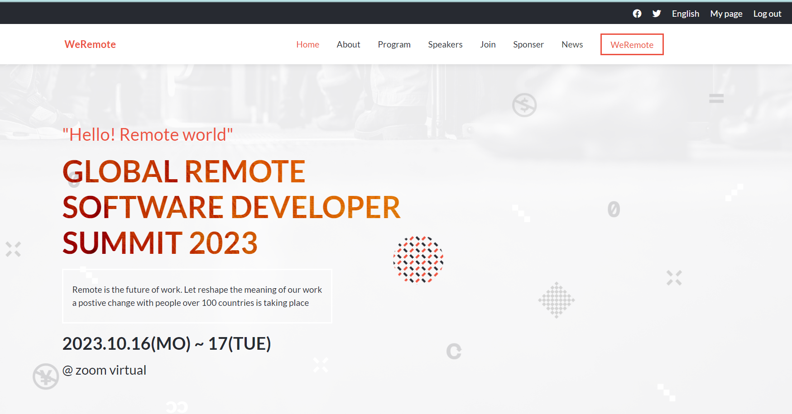

# Capstone-project

This is a project acknowledging and affirming that I have properly understood everything learnt so far from the first module.

- Here is the page preview

> |     | Mobile version                                  | Desktop version                                  |     |
> | --- | ----------------------------------------------- | ------------------------------------------------ | --- |
> |     |  |  |

This project is to put to test the understanding of individual student on what they've studied so far from the curriculum's module 1.

> Learning objectives

- I Used semantic HTML tags.
- I Applied best practices in HTML code.
- Used CSS selectors correctly.
- Used CSS box model.
- Used Flexbox to place elements on the page.
- Demonstrated ability to create UIs adaptable to different screen sizes using media queries.
- Used GitHub Pages to deploy web pages.
- Applied JavaScript best practices and language style guides in code.
- Used JavaScript to manipulate DOM elements.
- Used JavaScript events.
- Used objects to store and access data.
- Communicated technical concepts to other technical people.

## Built With

- HTML
- CSS
- JAVASCRIPT

Click [here]() to watch a walk-through description, given by me.

## Additional Tools

- WebHint
- Stylelint
- ESlint
- Node Packet Manager

## Live Demo

[Here]() is the live demo.

## Getting Started

To get a local copy of this project up and running on your local machine follow the steps below.

### Prerequisites

- Basic html, css and medium Javascript know how.
- Git installation
- A text editor
- A terminal
- A web browser to view output e.g Google Chrome
- An IDE e.g Visual studio code

### Setup

- Clone this repository or download the Zip folder:

```
git clone https://github.com/musangamfure/capstone-project-module1.git
```

- Navigate to the location of the folder in your machine:

**`you@your-Pc-name:~$ cd <folder>`**

### Usage

- After Cloning this repo to your local machine
- Open the `index.html` in your browser

### Run Tests

To track linter errors locally follow these steps:

Download all the dependencies run:

```
npm install
```

Track HTML linter errors run:

```
npx hint .
```

Track CSS linter errors run:

```
npx stylelint "**/*.{css,scss}"
```

Track JavaScript linter errors run:

```
npx eslint .
```

### Deployment

- I used GitHub Pages to deploy my website
- For more information about publishing sources, see "[About github page](https://docs.github.com/en/pages/getting-started-with-github-pages/about-github-pages#publishing-sources-for-github-pages-sites)"

## Author

👤 **Is-Musangamfura Emmanuel**

- GitHub: [@musangamfure](https://github.com/musangamfure)
- Twitter: [@musangamfure](https://twitter.com/musangamfure)
- LinkedIn: [@Musangamfura Emmanuel](https://www.linkedin.com/in/musangamfura-emmanuel-6a214a262/)

## Credits

- The original design ideal by [Cindy Shin in Behance](https://www.behance.net/adagio07)
- Project from [Microverse](https://bit.ly/MicroverseTN) html & css module
- Images inspired by [Unsplash](unsplash.com)

## Contributing

Contributions, issues, and feature requests are welcome!
Feel free to check the [issues page](https://github.com/musangamfure/capstone-project-module1/issues).

## Show your support

Give a ⭐️ if you like this project and how we manage to build it!

## Acknowledgments

- Thanks to the Microverse team for the great curriculum.
- Thanks to the Code Reviewer(s) for the insightful feedbacks.
- A great thanks to My coding partner(s), morning session team, and standup team for their contributions.
- Hat tip to anyone whose code was used.

## 📝 License

This project is [MIT](./LICENSE) licensed.
